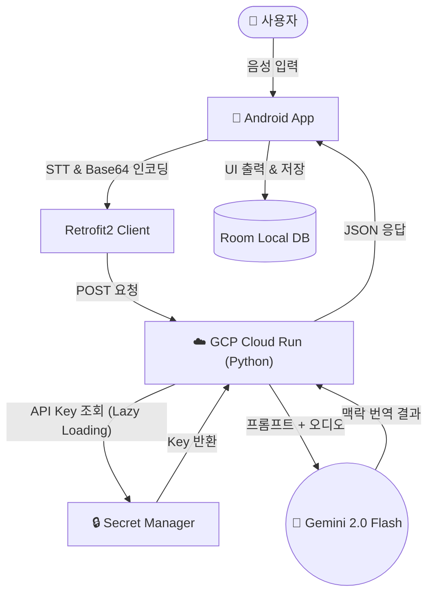

# 🎙️ Gemini AI Voice Translator (Serverless Context-Aware Interpreter)

> **Google Gemini 2.0 Flash 모델과 GCP Serverless 아키텍처를 활용한 맥락 인식 기반의 양방향 음성 통역 안드로이드 앱**


## 📖 프로젝트 소개 (Overview)
기존의 규칙 기반 번역기(Rule-based/SMT)가 가진 딱딱한 직역 투와 문맥 파악의 한계를 극복하기 위해 개발된 프로젝트입니다. 
**Google Gemini 2.0 Flash**의 강력한 LLM 성능을 활용하여, 대화의 맥락(Context)을 이해하고 생략된 주어를 추론하여 자연스러운 통역 결과를 제공합니다.

또한, 학생 개발자 수준에서 놓치기 쉬운 **보안(Secret Manager)**과 **비용 효율성(Serverless)**을 고려하여 프로덕션 레벨의 아키텍처를 설계했습니다.

---

## ✨ 주요 기능 (Key Features)

* **🗣️ 실시간 양방향 음성 통역**: 한국어, 영어, 일본어, 중국어 등 다국어 음성을 인식하여 실시간으로 번역 및 TTS 출력.
* **🧠 문맥 인식 (Context Awareness)**: "그거 어디서 샀어?"와 같이 주어가 생략된 문장도 이전 대화 맥락을 파악하여 정확하게 번역.
* **🚫 로마자 표기 자동 제거 (No Romanization)**: 일본어/한국어 번역 시 발생하는 발음 표기(예: Konnichiwa) 문제를 **프롬프트 엔지니어링**으로 해결.
* **💾 대화 기록 영구 저장**: **Room Database**를 적용하여 인터넷 연결이 끊겨도 이전 통역 기록 조회 가능.
* **🔒 엔터프라이즈급 보안**: API Key를 코드에 하드코딩하지 않고 **Google Secret Manager**를 통해 안전하게 관리.
* **⚡ 최적화된 서버 구조**: **Lazy Loading** 기법을 적용하여 Serverless Cold Start 문제를 해결하고 초기 응답 속도 개선.

---

## 🏗️ 시스템 아키텍처 (Architecture)



## 🛠️ 기술 스택 (Tech Stack)

### 📱 Android (Client)
* **Language**: Kotlin
* **Architecture**: MVVM Pattern (ViewModel, LiveData) 
* **Network**: Retrofit2, OkHttp3
* **Database**: Room Database (Local Persistence)
* **Concurrency**: Kotlin Coroutines (Asynchronous Handling)
* **Voice**: Android SpeechRecognizer, TextToSpeech (TTS)

### ☁️ Backend (Serverless)
* **Platform**: Google Cloud Platform (Cloud Run / Cloud Functions)
* **Language**: Python 3.x
* **Framework**: Functions Framework (Flask based)
* **Security**: Google Secret Manager, IAM (Identity and Access Management)

### 🧠 AI Model
* **Engine**: Google Gemini 2.0 Flash
* **Technique**: Prompt Engineering (Context-Aware, Negative Prompting, Persona)

---

## 💡 트러블슈팅 (Troubleshooting History)

개발 과정에서 마주친 주요 기술적 난관과 해결 과정입니다.

### 1. 로마자 표기(Romanization) 출력 문제
* **문제**: 일본어 번역 시 번역문 대신 "Konnichiwa"와 같은 발음 기호가 출력됨.
* **원인**: LLM이 비라틴권 언어를 영어로 변환할 때 음차 표기를 우선하는 경향이 있음.
* **해결**: 시스템 프롬프트에 **Negative Constraint(부정 제약)**를 적용.
  > *"NEVER output Romanization. Provide ONLY the translated text."*

### 2. Serverless Cold Start 및 타임아웃
* **문제**: 배포 직후 첫 요청 시 Secret Manager 연결 지연으로 인해 500 에러 발생.
* **원인**: 전역 변수 초기화 시점에 외부 네트워크 호출이 몰려 컨테이너 부팅 시간 초과.
* **해결**: **Lazy Loading(지연 로딩)** 패턴 적용. API Key 호출 시점을 서버 부팅 시점이 아닌 '최초 요청 시점'으로 미루어 안정성 확보.

### 3. 데이터 휘발성 문제
* **문제**: 앱 재실행 시 이전 통역 기록이 모두 사라짐.
* **해결**: 안드로이드 표준 로컬 DB인 **Room**을 도입하여 네트워크 통신 성공 시 비동기적으로 데이터를 영구 저장하도록 구현.

---

## 📝 프롬프트 엔지니어링 (Prompt Engineering)

단순히 AI에게 질문하는 것이 아니라, 명확한 **Role(역할)**과 **Rule(규칙)**을 부여하여 출력 품질을 제어했습니다.

```python
prompt = f"""
[Role Definition]
You are a professional interpreter with 20 years of experience.

[Strict Instructions]
1. Listen to the audio and understand the context.
2. Translate the content into natural, native-level {target_lang}.

[Negative Constraints]
1. NEVER output Romanization (e.g., 'Konnichiwa').
2. Do NOT include pronunciation guides.

[Output Format]
Provide ONLY the translated text.
"""


https://github.com/user-attachments/assets/a68ca1db-efdb-4c6a-8913-dca33315345a


